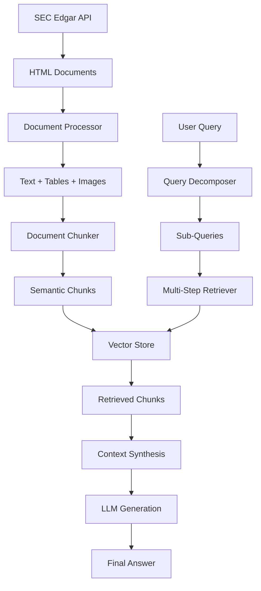

# Financial RAG Assistant - System Overview

## 🏗️ System Architecture

The Financial RAG Assistant is a comprehensive system designed to extract, process, and intelligently query SEC financial filings. It implements a sophisticated Retrieval-Augmented Generation (RAG) pipeline specifically optimized for financial document analysis.

### Core Components

#### 1. **SEC Edgar Extractor** (`src/sec_extractor.py`)
- **Purpose**: Downloads 10-K filings from SEC's Edgar database
- **Features**:
  - Company ticker to CIK mapping for GOOGL, MSFT, NVDA
  - Automated filing discovery for specified years (2022-2024)
  - Rate limiting compliance with SEC requirements
  - Robust error handling and retry mechanisms

#### 2. **Document Processor** (`src/document_processor.py`)
- **Purpose**: Multi-modal document processing pipeline
- **Features**:
  - **Text Extraction**: Clean HTML-to-text conversion
  - **Table Processing**: HTML tables → Pandas DataFrames → Markdown
  - **Image Captioning**: AI-powered chart/graph description using BLIP model
  - **Structure Preservation**: Maintains original document layout and context

#### 3. **Document Chunker** (`src/document_chunker.py`)
- **Purpose**: Intelligent document segmentation
- **Features**:
  - Paragraph-based splitting with `\n\n` detection
  - Smart size management (max 2000 chars, min 100 chars)
  - Contextual overlap between chunks (200 chars)
  - 10-K section identification (Business, Risk Factors, MD&A, etc.)
  - Metadata enrichment (company, year, section)

#### 4. **Vector Store** (`src/vector_store.py`)
- **Purpose**: High-performance vector search with Qdrant
- **Features**:
  - Sentence Transformer embeddings (all-MiniLM-L6-v2)
  - Batch processing for efficient storage
  - Multi-dimensional filtering (company, year, section)
  - Similarity search with relevance scoring
  - Collection management and statistics

#### 5. **Query Decomposer** (`src/query_decomposer.py`)
- **Purpose**: Intelligent query analysis and decomposition
- **Features**:
  - **Query Classification**: Simple, Comparative, Cross-Company, Calculation
  - **Entity Extraction**: Companies, years, financial metrics
  - **Sub-query Generation**: Breaks complex queries into manageable parts
  - **Calculation Detection**: Identifies growth, comparison needs

#### 6. **Multi-Step Retriever** (`src/multi_step_retriever.py`)
- **Purpose**: Advanced retrieval and context synthesis
- **Features**:
  - Multi-step retrieval for complex queries
  - Context synthesis from multiple sources
  - Financial data extraction and structuring
  - Number parsing with unit conversion
  - LLM integration for final answer generation

#### 7. **RAG Assistant** (`src/rag_assistant.py`)
- **Purpose**: Main orchestration layer
- **Features**:
  - End-to-end pipeline management
  - Async processing for performance
  - State management and persistence
  - Error handling and recovery
  - System status monitoring

## 🔄 Data Flow Pipeline



## 🤖 Query Processing Intelligence

### Query Type Classification

1. **Simple Direct Queries**
   - Pattern: Single company + metric + year
   - Example: "What was Microsoft's revenue in 2023?"
   - Processing: Direct vector search with filters

2. **Comparative Queries** 
   - Pattern: Time-based comparisons
   - Example: "How did NVIDIA's revenue grow from 2022 to 2023?"
   - Processing: Multi-year retrieval + calculation

3. **Cross-Company Analysis**
   - Pattern: Multi-company comparisons
   - Example: "Which company had highest margins in 2023?"
   - Processing: Parallel retrieval + ranking

### Entity Recognition

- **Companies**: Natural language → Ticker mapping
  - "Microsoft" → "MSFT"
  - "Google", "Alphabet" → "GOOGL" 
  - "NVIDIA" → "NVDA"

- **Financial Metrics**: Semantic understanding
  - Revenue: "sales", "total revenue", "net sales"
  - Profit: "net income", "earnings", "profit"
  - Margins: "operating margin", "profit margin"

- **Years**: Pattern matching with validation
  - Extracts 4-digit years (2020-2025)
  - Handles ranges and multiple years

## 💾 Storage & Retrieval Architecture

### Vector Database Schema
```json
{
  "id": "uuid",
  "vector": [384-dim embedding],
  "payload": {
    "chunk_id": "unique_chunk_identifier",
    "content": "chunk_text_content",
    "company": "MSFT|GOOGL|NVDA",
    "year": 2023,
    "section": "business|financial_data|md_a",
    "source_file": "path/to/original/file",
    "metadata": {
      "tables_count": 3,
      "images_count": 1,
      "source_type": "10-K"
    }
  }
}
```

### Embedding Strategy
- **Model**: sentence-transformers/all-MiniLM-L6-v2
- **Dimension**: 384
- **Distance Metric**: Cosine similarity
- **Chunking**: Paragraph-aware with overlap
- **Metadata**: Rich filtering capabilities

## 🧠 LLM Integration

### Context Synthesis
- **Relevance Ranking**: Score-based chunk ordering
- **Deduplication**: Chunk ID-based uniqueness
- **Context Limits**: Top 10 chunks, max 10K tokens
- **Source Attribution**: Company, year, section tracking

### Answer Generation
- **Model**: GPT-4 (configurable)
- **Temperature**: 0.1 (factual consistency)
- **Max Tokens**: 1000
- **System Prompt**: Financial analyst persona with strict guidelines

### Calculation Support
- **Growth Rates**: Automatic percentage calculations
- **Comparisons**: Multi-company ranking and analysis
- **Unit Conversion**: Millions/billions normalization
- **Number Extraction**: Regex-based financial figure parsing

## 🛡️ Error Handling & Resilience

### Network & API Resilience
- **SEC Rate Limiting**: Built-in delays and retries
- **OpenAI Quota**: Graceful degradation and error reporting
- **Qdrant Connection**: Health checks and reconnection
- **Timeout Management**: Configurable timeouts for all external calls

### Data Validation
- **Document Integrity**: File existence and format validation
- **Embedding Quality**: Dimension and content checks
- **Query Validation**: Malformed query detection
- **Result Verification**: Empty result handling

### Performance Optimization
- **Async Processing**: Non-blocking I/O operations
- **Batch Operations**: Efficient bulk processing
- **Caching**: Processed document persistence
- **Memory Management**: Streaming for large files

## 📊 Performance Characteristics

### Processing Speed
- **SEC Download**: ~10-30 seconds per filing
- **Document Processing**: ~1-5 minutes per filing
- **Embedding Generation**: ~30 seconds per 1000 chunks
- **Query Response**: ~2-10 seconds depending on complexity

### Resource Requirements
- **Memory**: 8GB+ recommended for processing
- **Storage**: ~100MB per processed filing
- **CPU**: Multi-core beneficial for parallel processing
- **Network**: Stable internet for SEC downloads

### Scalability
- **Documents**: Tested with 10+ filings simultaneously
- **Chunks**: Handles 10K+ chunks efficiently
- **Queries**: Sub-second search on 10K+ vectors
- **Concurrent Users**: Designed for single-user, extensible

## 🔧 Configuration & Customization

### Environment Variables
```bash
OPENAI_API_KEY=required          # GPT-4 access
QDRANT_HOST=localhost           # Vector DB host
QDRANT_PORT=6333               # Vector DB port
SEC_API_KEY=optional           # Rate limit increase
HUGGINGFACE_API_KEY=optional   # Image captioning
```

### Customizable Parameters
```python
# Chunking parameters
max_chunk_size = 2000          # Maximum chunk size
min_chunk_size = 100           # Minimum chunk size
overlap_size = 200             # Overlap between chunks

# Vector store settings
embedding_model = "all-MiniLM-L6-v2"  # Embedding model
collection_name = "financial_docs"     # Qdrant collection
vector_dimension = 384                 # Embedding dimension

# Retrieval settings
top_k = 5                      # Results per query
similarity_threshold = 0.7     # Minimum similarity score
```

## 🚀 Future Enhancements

### Planned Features
1. **Multi-Document Types**: 10-Q, 8-K, proxy statements
2. **Extended Company Coverage**: S&P 500 companies
3. **Advanced Analytics**: Trend analysis, peer comparisons
4. **Real-time Updates**: Automatic filing monitoring
5. **Web Interface**: User-friendly dashboard
6. **API Endpoints**: RESTful API for integration

### Technical Improvements
1. **Hybrid Search**: Combining vector and keyword search
2. **Fine-tuned Models**: Domain-specific embeddings
3. **Caching Layer**: Redis for query result caching
4. **Monitoring**: Comprehensive logging and metrics
5. **Testing**: Automated test suite and benchmarks

## 📈 Use Cases & Applications

### Financial Analysis
- **Due Diligence**: Rapid company analysis
- **Investment Research**: Multi-company comparisons
- **Risk Assessment**: Risk factor analysis
- **Performance Tracking**: Historical trend analysis

### Academic Research
- **Finance Studies**: Large-scale data analysis
- **NLP Research**: Financial document processing
- **Business Intelligence**: Market analysis
- **Regulatory Compliance**: Filing analysis

### Professional Services
- **Consulting**: Client company analysis
- **Accounting**: Financial statement analysis
- **Legal**: Regulatory compliance checking
- **Banking**: Credit analysis and risk assessment

---

This system represents a sophisticated approach to financial document analysis, combining modern NLP techniques with domain-specific financial knowledge to create an intelligent and responsive assistant for financial data exploration.